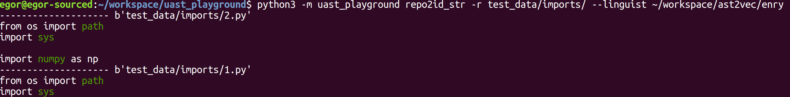

## UAST playground

Some tools to play with UAST & bblfsh.

## Install

```
git clone git+https://github.com/egorbu/uast_playground
cd uast_playground
pip3 install -r requirements.txt
```

## Usage
```
python3 -m uast_playground repo2id_str -r repo
```

## Example
